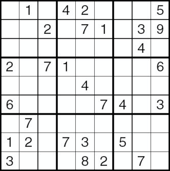
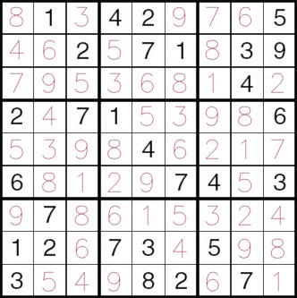

# SudokuSolver

######Don't ask.

Contributors:

 * [Mikkel Kim](https://github.com/MikkelKim)
 * [Jungmo Ku](https://github.com/suhojm)
 * [Hyunchel Kim](https://github.com/hyunchel)

## Introduction

This application reads an image of Sudoku problem, solves the problem, and outputs a solution image.

Example problem set and solution set follows:

## Objectives

Objective 1: Read numbers and solve

 * Read numbers from clean sudoku image using Tesseract and stitch number images into the solution

Objective 2: Take picture and clean the image

 * By image processing step, clean the image to use for objective 1

Objective 3: Extend the application for Android ans iOS use

 * Let the application to take the picture of sudoku and get the solution

## Test

Will be implemented.

## Dependencies

opencv-3.1.0
tesseract-3.05.00dev

Docker image is used to compile and run our application.
The exact docker image is uploaded to [gnis/vision][0].

**More details on dependencies and installation steps will be updated to README.**

[0]: http://hub.docker.com/r/gnis/vision
